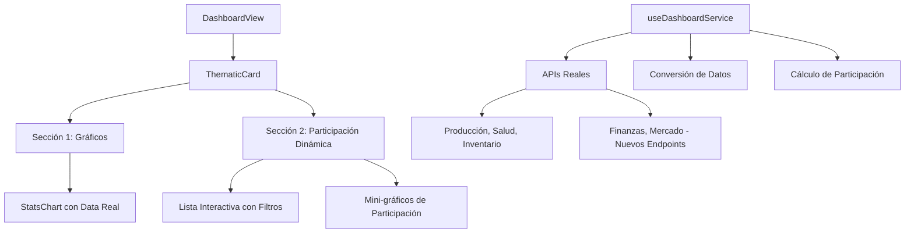

# Plan Detallado para Implementar Gráficos con Data Real y Sección 2 Dinámica

## Visión General

Este plan describe la implementación de mejoras al sistema de dashboard para integrar gráficos con datos reales provenientes de APIs y hacer la sección 2 (Participación Farms/KPIs) más dinámica e interactiva. El objetivo es proporcionar una experiencia de usuario más rica con datos precisos y funcionalidades interactivas.

## Análisis Actual del Sistema

### Estructura Actual
- **Gráficos**: Utilizan Highcharts con datos de `themeData.tabs[activeTab].chartData`
- **Sección 1**: Tabs dinámicos para diferentes vistas de gráficos
- **Sección 2**: Panel estático mostrando participación de farms/KPIs
- **APIs Disponibles**: Producción lechera, salud animal, inventario, total animales
- **Limitaciones**: Algunos temas usan datos simulados, sección 2 es estática

## Objetivos

1. **Gráficos con Data Real**:
   - Integrar datos reales para todos los temas
   - Agregar más tipos de gráficos y métricas
   - Mejorar manejo de errores y fallbacks

2. **Sección 2 Dinámica**:
   - Agregar interactividad (ordenamiento, filtrado)
   - Integrar datos reales de participación
   - Mejorar visualización con gráficos adicionales

## Plan de Implementación

### Fase 1: Mejoras en Gráficos con Data Real

#### 1.1 Extender APIs Disponibles
- **Objetivo**: Agregar endpoints para temas faltantes
- **Tareas**:
  - Identificar temas sin API real (Finanzas, Mercado, etc.)
  - Crear nuevos endpoints faltantes `api.js` (la documentacion esta en  `AgroGestion.yaml`)
  - Implementar llamadas a APIs V2 para métricas adicionales

#### 1.2 Mejorar Conversión de Datos
- **Objetivo**: Estandarizar formato de datos para gráficos
- **Tareas**:
  - Refactorizar `convertToChartData` para manejar diferentes formatos de respuesta
  - Agregar soporte para múltiples series en un gráfico
  - Implementar validación de datos antes de renderizar

#### 1.3 Enriquecer Tipos de Gráficos
- **Objetivo**: Ofrecer más visualizaciones
- **Tareas**:
  - Modificar `StatsChart.vue` para soportar tipos adicionales (líneas, áreas, combinados,barras)
  - Agregar configuración dinámica de tipos de gráfico por tema
  - Implementar tooltips y leyendas mejoradas

### Fase 2: Sección 2 Dinámica

#### 2.1 Arquitectura de Datos para Participación
- **Objetivo**: Obtener datos reales de participación
- **Tareas**:
  - Crear nueva API para obtener participación por entidad
  - Modificar `generateThemeData` para incluir datos reales de participación
  - Implementar cálculo dinámico de porcentajes basado en datos reales

#### 2.2 Interactividad en Sección 2
- **Objetivo**: Hacer la sección más funcional
- **Tareas**:
  - Agregar botones de ordenamiento (por nombre, porcentaje, valor)
  - Implementar filtros para mostrar/ocultar elementos
  - Agregar tooltips con información detallada al hover

### Fase 3: Integración y Testing

#### 3.1 Actualización del Servicio de Dashboard
- **Objetivo**: Unificar lógica de datos
- **Tareas**:
  - Refactorizar `useDashboardService.js` para manejar nuevos tipos de datos
  - Implementar cache inteligente para datos de participación
  - Agregar manejo de errores específico para cada tipo de dato

#### 3.2 Modificaciones en Componentes
- **Objetivo**: Actualizar UI para nuevas funcionalidades
- **Tareas**:
  - Modificar `ThematicCard.vue` para sección 2 dinámica
  - Actualizar `StatsChart.vue` para nuevos tipos de gráficos
  - Agregar nuevos props y eventos para interactividad

#### 3.3 Testing y Validación
- **Objetivo**: Asegurar calidad de implementación
- **Tareas**:
  - Crear tests unitarios para nuevas funciones
  - Probar integración con APIs reales
  - Validar rendimiento con datos grandes

## Diagrama de Arquitectura

## Riesgos y Mitigaciones

- **Dependencia de APIs**: Implementar fallbacks robustos
- **Rendimiento**: Optimizar carga de datos y renderizado
- **Compatibilidad**: Probar en diferentes navegadores y dispositivos

## Métricas de Éxito

- 100% de gráficos usando datos reales
- Sección 2 con al menos 3 funcionalidades interactivas
- Tiempo de carga reducido en <10% para datos reales
- Feedback positivo de usuarios en usabilidad