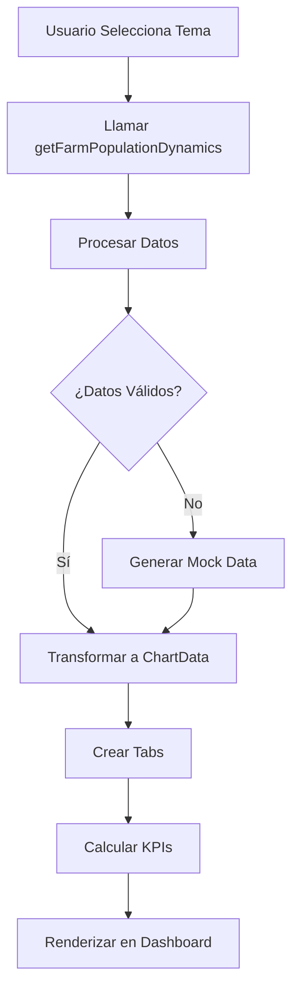

# Propuesta de Tema: Dinámicas Poblacionales Diarias

## Visión General
Implementar un nuevo tema en el dashboard de AgroGestión para visualizar y analizar las dinámicas poblacionales diarias en las granjas. Este tema proporcionará métricas detalladas sobre nacimientos, muertes, entradas y salidas de animales, permitiendo una gestión eficiente del inventario animal y toma de decisiones informadas sobre producción y salud.

## Objetivos
- Ofrecer una vista diaria y histórica de los cambios en la población animal.
- Calcular y mostrar KPIs clave relacionados con natalidad, mortalidad y crecimiento poblacional.
- Integrar seamlessly con el sistema existente de temas en `themeOrchestrator.js`.
- Proporcionar datos accionables para optimizar la gestión ganadera.

## APIs Requeridas
- **Nueva API**: `getFarmPopulationDynamics(entityId, startDate, endDate)` - Devuelve estadísticas diarias de población incluyendo nacimientos, muertes, entradas, salidas y población total.
- **API existente**: Usaremos los 4 endpoints v2 específicos para inventory para los datos de nacimientos.

## Estructura de Datos
Los datos diarios serán estructurados como un array de objetos con la siguiente forma:
```json
{
  "date": "2023-10-01",
  "births": 5,
  "deaths": 2,
  "entries": 3,
  "exits": 1,
  "total_population": 1250
}
```

## Procesamiento de Datos
- Utilizar la función existente `transformDataToChartFormat` para convertir datos a formato compatible con gráficos.
- Generar datos mock cuando no existan datos reales, similar a otros temas.
- Implementar lógica para calcular KPIs basados en los datos diarios.

## Tabs Propuestos
1. **Población Total**: Gráfico de línea mostrando la evolución de la población total a lo largo del tiempo.
2. **Nacimientos**: Gráfico de barras o línea de nacimientos diarios.
3. **Muertes**: Gráfico de muertes diarias para monitoreo de salud.
4. **Entradas/Salidas**: Gráfico combinado (stacked) de entradas y salidas netas.

## KPIs
- **Tasa de Natalidad**: `(Nacimientos / Población Total) * 100` - Porcentaje de nacimientos respecto a la población.
- **Tasa de Mortalidad**: `(Muertes / Población Total) * 100` - Porcentaje de muertes respecto a la población.
- **Crecimiento Diario**: `((Nacimientos - Muertes + Entradas - Salidas) / Población Total) * 100` - Cambio porcentual diario en la población.
- **Eficiencia Reproductiva**: Métrica adicional basada en nacimientos vs. población reproductiva.

## Implementación Técnica

### Agregado a themeDefinitions en themeOrchestrator.js
```javascript
population_dynamics: {
  apiFunc: getFarmPopulationDynamics,
  valueKey: 'total_population',
  additionalApis: {
    births: getFarmBirths  // Opcional para validación
  },
  process: async (data, additionalData, entityId, signal) => {
    // Procesamiento de datos
    let populationData = data
    if (!populationData || populationData.length === 0) {
      populationData = generateMockData(30, 'total_population', [1000, 1500])
    }

    const chartData = transformDataToChartFormat(populationData, 'total_population')
    chartData.name = 'Población Total'

    // Tabs para diferentes métricas
    const tabs = [
      {
        title: 'Población Total',
        chartData,
        lastRecord: {
          date: chartData.lastRecordDate?.toISOString() || new Date().toISOString(),
          value: chartData.values[chartData.values.length - 1] || 0,
          description: 'Población actual'
        },
        yTitle: 'Número de Animales'
      },
      // Otros tabs para births, deaths, etc.
    ]

    // Calcular KPIs
    const kpisData = calculateKPIsForTheme('population_dynamics', populationData)

    return { tabs, kpisData }
  }
}
```

### Agregado a themeDisplayNames
```javascript
'population_dynamics': 'Dinámicas Poblacionales Diarias'
```

## Diagrama de Flujo


## Consideraciones de UI/UX
- Utilizar colores consistentes con la paleta existente (verde #00C853, azul #0288D1).
- Implementar tooltips en gráficos para mostrar valores exactos por fecha.
- Asegurar responsividad para diferentes tamaños de pantalla.

## Próximos Pasos
1. **Desarrollo Backend**: Implementar la API `getFarmPopulationDynamics` en el servidor.
2. **Integración Frontend**: Agregar el nuevo tema a `themeOrchestrator.js` y `ThemeSelector.vue`.
3. **Testing**: Probar con datos reales y mock para asegurar funcionalidad.
4. **Documentación**: Actualizar documentación de APIs y componentes afectados.
5. **Despliegue**: Incluir en el próximo release con feature flag opcional.

## Riesgos y Mitigaciones
- **Falta de Datos**: Mitigado con generación de mock data y validaciones.
- **Performance**: Procesar datos en chunks si el rango de fechas es muy amplio.
- **Consistencia**: Asegurar que cálculos de KPIs sean consistentes con otras métricas del sistema.

Esta propuesta establece una base sólida para implementar el tema de Dinámicas Poblacionales Diarias, alineándose con la arquitectura existente y proporcionando valor significativo a los usuarios del dashboard.