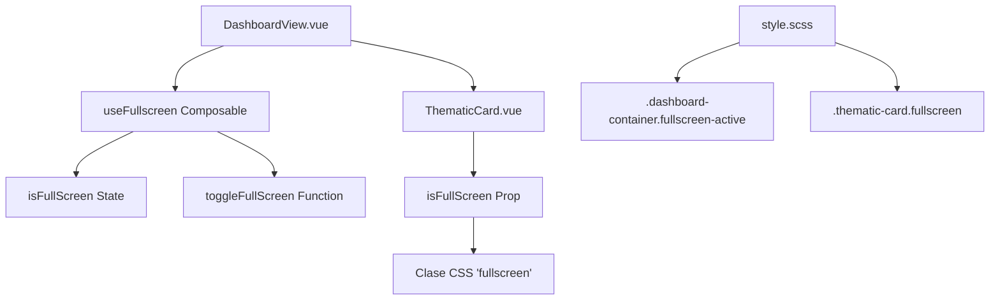
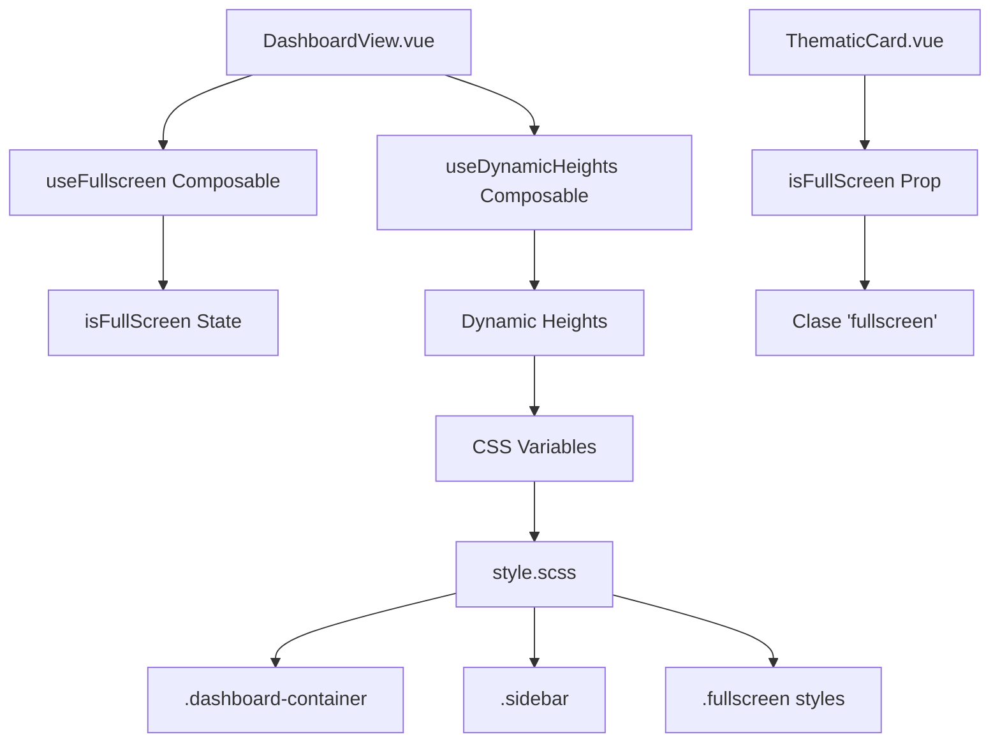

# Plan de Refactorización del Modo Fullscreen

## Contexto Actual
La lógica de fullscreen está distribuida en varios archivos con inconsistencias:

- **DashboardView.vue**: Maneja estado `isFullScreen`, función `toggleFullScreen`, event listeners para 'fullscreenchange' y 'keydown'.
- **ThematicCard.vue**: Tiene prop `isFullScreen` (no utilizada) y clase CSS `.fullscreen` (no aplicada).
- **style.scss**: Estilos para `.dashboard-container.fullscreen-active` que afectan elementos internos.

### Estado Actual (Después de Revisión)
- ✅ Composable `useFullscreen.js` implementado correctamente.
- ✅ DashboardView.vue usa el composable y pasa la prop `isFullScreen`.
- ✅ ThematicCard.vue recibe la prop y aplica clase `'fullscreen'`.
- ❌ **Error CSS**: Estilos usan selector `.dashboard-container.fullscreen-active .thematic-card` en lugar de `.thematic-card.fullscreen`.
- ✅ Lógica centralizada en composable.

### Problemas Identificados
1. **Inconsistencia en selectores CSS**: El componente aplica clase `'fullscreen'` pero los estilos usan un selector diferente.
2. **Estilos no aplicados**: La clase `.thematic-card.fullscreen` no tiene estilos definidos.
3. **Duplicación potencial**: Verificar si hay reglas redundantes.

## Plan de Refactorización

### 1. Crear Composable `useFullscreen.js`
Centralizar toda la lógica de fullscreen en un composable reutilizable.

```javascript
// src/composables/useFullscreen.js
import { ref, onMounted, onUnmounted } from 'vue'

export function useFullscreen(targetSelector = '.dashboard-container') {
  const isFullScreen = ref(false)

  const toggleFullScreen = async () => {
    const target = document.querySelector(targetSelector)
    if (!document.fullscreenElement) {
      try {
        await target.requestFullscreen()
      } catch (error) {
        console.error('Error entering fullscreen:', error)
      }
    } else {
      try {
        await document.exitFullscreen()
      } catch (error) {
        console.error('Error exiting fullscreen:', error)
      }
    }
  }

  const handleFullscreenChange = () => {
    isFullScreen.value = !!document.fullscreenElement
  }

  const handleKeyDown = (event) => {
    if (event.key === 'Escape' && isFullScreen.value) {
      toggleFullScreen()
    }
  }

  onMounted(() => {
    document.addEventListener('fullscreenchange', handleFullscreenChange)
    window.addEventListener('keydown', handleKeyDown)
  })

  onUnmounted(() => {
    document.removeEventListener('fullscreenchange', handleFullscreenChange)
    window.removeEventListener('keydown', handleKeyDown)
  })

  return {
    isFullScreen,
    toggleFullScreen
  }
}
```

### 2. Actualizar DashboardView.vue
Usar el composable y pasar la prop a ThematicCard.

```vue
<script setup>
// ... otros imports
import { useFullscreen } from '../composables/useFullscreen.js'

// ... otros composables
const { isFullScreen, toggleFullScreen } = useFullscreen()

// Remover lógica inline de fullscreen
</script>

<template>
  <div ref="dashboardContainerRef" class="dashboard-container" :class="{ 'fullscreen-active': isFullScreen }">
    <!-- ... -->
    <ThematicCard
      :themeData="themesData[currentThemeIndex]"
      :index="currentThemeIndex + 1"
      :loading="cardLoadingStates.get(currentThemeIndex)"
      :progress="cardProgressStates.get(currentThemeIndex) || 0"
      :isFullScreen="isFullScreen"
    />
  </div>
</template>
```

### 3. Actualizar ThematicCard.vue
Asegurar que la prop se use correctamente.

```vue
<template>
  <div class="thematic-card dashboard-section-row p-1 rounded" :class="{ 'fullscreen': isFullScreen }" :id="`card-${index}`" ref="cardRef">
    <!-- ... contenido -->
  </div>
</template>
```

### 4. Consolidar Estilos en style.scss
Eliminar duplicaciones y asegurar consistencia.

```scss
/* Fullscreen styles */
.dashboard-container.fullscreen-active {
  display: flex !important;
  flex-direction: column !important;
  height: 100vh !important;
  color: black !important;
}

/* Ocultar elementos en fullscreen */
.dashboard-container.fullscreen-active .sidebar,
.dashboard-container.fullscreen-active .drawer-toggle,
.dashboard-container.fullscreen-active .navbar-header {
  display: none !important;
}

/* ThematicCard en fullscreen */
.thematic-card.fullscreen {
  position: fixed !important;
  top: 0 !important;
  left: 0 !important;
  width: 100vw !important;
  height: 100vh !important;
  z-index: 9999 !important;
  background: var(--bs-body-bg) !important;
}
```

## Diagrama de Arquitectura Refactorizada



## Beneficios
- **Centralización**: Toda lógica en un lugar atómico.
- **Reutilización**: El composable puede usarse en otros componentes.
- **Mantenimiento**: Cambios en fullscreen afectan solo el composable.
- **Consistencia**: Estilos y lógica alineados.
- **Corrección de Errores**: Prop correctamente pasada, duplicaciones eliminadas.

## Correcciones Aplicadas
1. ✅ **Corregir selectores CSS**: Cambiado `.dashboard-container.fullscreen-active .thematic-card` por `.thematic-card.fullscreen` en `style.scss`.
2. ✅ **Agregar estilos faltantes**: `.thematic-card.fullscreen` ahora tiene los estilos correctos con `!important`.
3. ✅ **Verificar consistencia**: No hay duplicaciones; estilos consolidados.

## Estado Final
- ✅ Lógica centralizada en `useFullscreen.js`.
- ✅ Prop `isFullScreen` correctamente pasada y utilizada.
- ✅ Estilos CSS consistentes y aplicados.
- ✅ Arquitectura modular y mantenible.

## Extensión: Implementación de Alturas Dinámicas

### Contexto Adicional
Además de la refactorización del fullscreen, se propone implementar alturas dinámicas usando un composable para evitar conflictos con CSS estático y permitir adaptación perfecta a cualquier resolución.

### Beneficios de Alturas Dinámicas
- Eliminación de conflictos entre alturas estáticas y dinámicas
- Adaptación automática a cambios de tamaño de ventana
- Centralización de lógica de cálculo de alturas
- Mejor consistencia en fullscreen y modos normales

### Plan de Implementación de Alturas Dinámicas

#### 1. Crear Composable `useDynamicHeights.js`
```javascript
// src/composables/useDynamicHeights.js
import { ref, onMounted, onUnmounted } from 'vue'

export function useDynamicHeights(offsets = { nav: 60, innerNav: 56 }) {
  const windowHeight = ref(window.innerHeight)
  const contentHeight = ref(0)
  const mainContentHeight = ref(0)
  const sidebarHeight = ref(0)
  const fullscreenHeight = ref(0)

  const updateHeights = () => {
    const height = window.innerHeight
    windowHeight.value = height
    contentHeight.value = height
    mainContentHeight.value = height - offsets.nav - offsets.innerNav - 16
    sidebarHeight.value = height - offsets.nav
    fullscreenHeight.value = height

    document.documentElement.style.setProperty('--dynamic-content-height', `${contentHeight.value}px`)
    document.documentElement.style.setProperty('--dynamic-main-content-height', `${mainContentHeight.value}px`)
    document.documentElement.style.setProperty('--dynamic-sidebar-height', `${sidebarHeight.value}px`)
    document.documentElement.style.setProperty('--dynamic-fullscreen-height', `${fullscreenHeight.value}px`)
  }

  const throttledUpdate = throttle(updateHeights, 100)

  onMounted(() => {
    updateHeights()
    window.addEventListener('resize', throttledUpdate)
  })

  onUnmounted(() => {
    window.removeEventListener('resize', throttledUpdate)
  })

  return {
    windowHeight,
    contentHeight,
    mainContentHeight,
    sidebarHeight,
    fullscreenHeight,
    updateHeights
  }
}

function throttle(func, limit) {
  let inThrottle
  return function() {
    const args = arguments
    const context = this
    if (!inThrottle) {
      func.apply(context, args)
      inThrottle = true
      setTimeout(() => inThrottle = false, limit)
    }
  }
}
```

#### 2. Actualizar `style.scss` con Variables Dinámicas
```scss
:root {
  --dynamic-content-height: 100vh;
  --dynamic-main-content-height: calc(100vh - 116px - 1rem);
  --dynamic-sidebar-height: calc(100vh - 60px);
  --dynamic-fullscreen-height: 100vh;
}

.dashboard-container {
  height: var(--dynamic-content-height);
}

.sidebar {
  height: var(--dynamic-sidebar-height);
}

.themes-container {
  height: var(--dynamic-main-content-height);
}

.dashboard-container.fullscreen-active {
  height: var(--dynamic-fullscreen-height) !important;
}

.thematic-card.fullscreen {
  height: var(--dynamic-fullscreen-height) !important;
}
```

#### 3. Integrar en `DashboardView.vue`
```vue
<script setup>
// ... imports
import { useDynamicHeights } from '../composables/useDynamicHeights.js'

const { /* heights */ } = useDynamicHeights()
// Remover cálculos inline de navbar height
</script>
```

#### 4. Limpiar CSS Obsoleto
- Remover `--content-height`, `--main-content-height` estáticos
- Reemplazar `calc(100vh - ...)` con variables dinámicas

### Diagrama de Arquitectura Completa



## Próximos Pasos
1. Implementar composable `useDynamicHeights.js`
2. Actualizar `style.scss` con variables dinámicas
3. Integrar composable en `DashboardView.vue`
4. Limpiar CSS obsoleto
5. Probar funcionalidad completa en el navegador
6. Verificar en diferentes dispositivos/resoluciones
7. Documentar cualquier ajuste adicional si surge